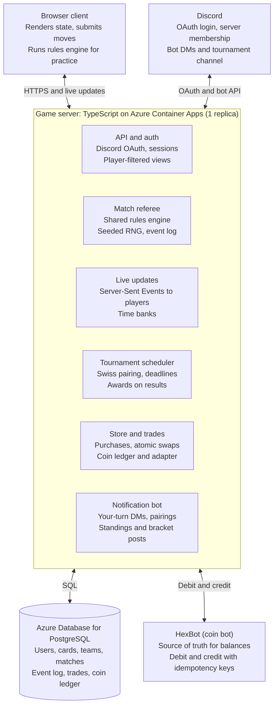

# Spellstick Online — Multiplayer & Tournament Design

Last updated: 2026-10-10 (decisions from Paul's review; see Change log)

## Overview

Spellstick moves from a browser-only game to a server-authoritative, async-first turn-based game. Readers own persistent collections, build teams, buy cards with the existing Discord coins, trade cards with each other, and play in Swiss tournaments.

This is a deliberate expansion of the project's scope (decided 2026-10-10). The physical game and the free browser game stay; the online game is added alongside them. `docs/GAME_DESIGN.md` and `CLAUDE.md` note what changed.

**Goals**

- Readers play each other online, live or one move at a time over days, on the same code.
- Tournaments run themselves: automatic pairings, results, standings, and deadlines.
- Cards become collectibles: owned instances with serial numbers, special award cards, and trading.
- Discord coins become spendable on cards.

**Key decisions**

1. **The server owns all game state.** Face-down placement, collections, coins, and trades are worthless if the browser can be edited. The client only renders and submits moves.
2. **Two match formats.** *Constructed* uses a player's persistent team. *Draft* gives everyone the same pool. Purchased cards make Constructed partly pay-to-win, so prize tournaments use Draft. (Capped Constructed waits for rarity, a future feature; see Match formats.)
3. **Discord is the identity layer.** Login is Discord OAuth; notifications go through a Discord bot.
4. **One rules engine, shared.** The existing engine in `src/engine/` runs on the server for real games and in the browser for previews and single-player.
5. **Time banks, not move timers.** Each player has a total amount of thinking time per match, like a chess clock. It runs only while the game is waiting on that player.
6. **Card designs stay in the repo.** `data/*.json` is the master copy of every card definition. The database is loaded from it on deploy.
7. **One repo.** The server lives in this repo next to the browser game and imports the engine directly.

**Non-goals for v1**

- Real-money purchases or any way to cash cards or coins out (see Risks).
- Multiplayer (pod) draft. It is designed for here but built in a later phase.
- Native mobile apps. The browser game stays mobile-friendly instead.
- Ranked ladder outside tournaments.
- Card rarity (future feature; see Cards, collection, and persistent teams).

## Architecture

One small game server sits between the browser, Discord, and the database, and it is the only part allowed to change game state, collections, or coins.

The browser shows each player only their filtered view and sends moves; the match referee checks every move against the shared rules engine before anything is saved.

**Stack (TypeScript on Azure)**

- **Server:** Node.js and TypeScript in one container, so the rules engine runs unchanged on server and browser.
- **Repo layout:** same repo. The server goes in its own folder (for example `server/`) and imports `src/engine/` directly. The browser build stays a static site; the server is deployed separately. *(Changed 2026-10-10: GitHub Pages no longer hosts the game; its old address shows a "moved" page that forwards to the Azure address.)*
- **Shared Azure resources (added 2026-10-10):** Spellstick reuses the existing aiuthor Container Apps environment, Postgres server (its own `spellstick` database and login), container registry, Key Vault (access to its own secret only), and log workspace in `rg-aiuthor`. Its own app and identities live in `rg-spellstick`. That Postgres server is publicly reachable with password sign-in turned off, rather than on a private network; moving to a private server later is a database dump and restore.
- **Hosting:** Azure Container Apps with minimum and maximum replicas both set to 1. *(Until live matches exist, minimum 0 to save cost; the first visit after a quiet spell takes a few seconds.)* The default minimum is 0 ([Azure scaling docs](https://learn.microsoft.com/azure/container-apps/scale-app)), and scaling to zero would drop live connections. *(Added 2026-10-10: an open live-update connection counts as an active request, so the app stays on while anyone has the game open, and scales to zero only when nobody does. Pages reconnect by themselves when it wakes.)* One replica keeps live connections in one process and easily handles a few hundred readers.
- **Cost:** an always-on container plus a managed Postgres server is an ongoing monthly Azure bill (roughly tens of dollars at small scale). Accepted by Paul 2026-10-10.
- **Time banks and deadlines:** stored in the database as due times, never only in memory. A Container Apps scheduled job runs every minute to expire time banks, close rounds, and reconcile coin transactions, so a restart or deploy never loses a deadline. *(Changed 2026-10-10 for time banks: instead of a separate scheduled job, the game server checks for overdue banks every 30 seconds while it's running, and again before answering any match request. Deadlines live in the database (`waiting_due`), so a restart loses nothing, and a deadline that passed while the server was asleep is applied as soon as anyone looks. No extra Azure resource. Revisit when round deadlines or Discord warnings need to happen on time even when nobody is online.)*
- **Database:** Azure Database for PostgreSQL (Flexible Server) with automated backups.
- **Secrets:** Azure Key Vault for the Discord client secret, bot token, and HexBot API key.
- **Live updates:** ~~plain WebSockets~~ Server-Sent Events in the game container (`GET /api/live`, `server/live.ts`). *Changed 2026-10-10: moves already go to the server as ordinary requests, so only server-to-browser messages are needed; Server-Sent Events do that over plain HTTP with no new dependency, and browsers reconnect by themselves.* Messages say only which match changed; the page then fetches its own filtered view, so live updates can't leak hidden cards. If you ever need more than one replica, move push messages to Azure Web PubSub instead of adding sticky sessions. Colyseus stays optional and is worth revisiting only for pod drafts.
- **HexBot:** if it also runs on Azure, put it in the same Container Apps environment so the game calls it over internal-only ingress, with no public coin endpoint.

## Game engine on the server

*Changed 2026-10-10: this section was "Game engine migration" and called extracting the rules "the largest single task." The engine in `src/engine/` was already built this way, so most of that work is done.*

The engine already has the shape the server needs. It is pure TypeScript with no UI, timers, or randomness of its own:

- `createGame(setup)` builds a game from decks, config, and a seed.
- `applyAction(state, action) → { state, events }` validates and applies one action, or throws `IllegalActionError`.
- `legalActions(state, side)` lists what a player may do now (drives the UI, the AI, and auto-play when a time bank runs out).
- `viewFor(state, side)` and `eventsFor(events, side)` remove everything that player may not see: the opponent's face-down cards, the opponent's hand, and the deck order.
- `replay(setup, actions)` rebuilds any game exactly from its seed and action list.

**Remaining work for the server:**

- ~~Package the engine so the server imports it without pulling in browser code.~~ Done: the server's type check and bundle include only `src/engine/` and `src/data/`.
- Turn the engine's `pending` decisions (whose move it is, reaction spells, dice calls) into server prompts, so the right player is asked and their time bank runs. *Partly done: each match records who it's waiting on and since when (`waiting_on`, `waiting_since`); time banks come later.*
- ~~Store the setup and action list per match; rebuild state on load with `replay`.~~ Done (2026-10-10), in `server/matches.ts`. A full game rebuilds in about 40 ms, so the server rebuilds on every request and keeps no cache. A move is accepted only if it exactly matches one of the engine's `legalActions` for that player. The setup is saved in full, rules settings included, so changing a default never changes a match already under way.

**Hidden information.** The server never sends the full state to a client. A face-down card is sent as a placeholder with only its position until a matchup reveals it. This is the rule that stops dev-tools cheating.

**Randomness.** All dice, shuffles, and injury draws use the engine's seeded generator on the server. The seed is stored with the match, so any game can be replayed exactly to settle disputes.

**Event log.** Every accepted action is appended to a per-match log with a timestamp. The current state is a cached result of replaying the log. This gives replays, dispute resolution, and shareable highlight clips for Discord at no extra cost.

**Injuries.** Injuries and substitutions stay inside a single match. They never damage a card in someone's collection; persistent injuries would punish collectors and make trades messy.

**Single-player stays.** The browser keeps running the same engine locally for practice against the computer, so the existing game keeps working throughout.

## Time banks

*Added 2026-10-10. Replaces the 24-hour move timer and the per-pick draft timer.*

A game averages about 45 turns, and the opponent also makes decisions mid-turn (reaction spells, calling for dice). A per-move timer would let one game take weeks. Instead, each player gets one **time bank** per match.

- The bank runs only while the game is waiting on that player: their turn, a reaction or dice decision, or a draft pick.
- Draft picks, lineup placement, and play all draw from the same bank.
- Banks are set per event in admin settings. Starting values, to tune after the beta:
  - **Live:** 25 minutes per player.
  - **Async:** 36 hours per player. Two banks add up to 3 days, so a match that starts with the round always finishes inside a 3–4 day round.
- **Bank runs out:** the computer opponent plays that player's remaining decisions, using `legalActions` and the existing AI. The game finishes normally and the result stands.
- **No-show:** if a player made no decisions at all before their bank ran out, the match is a forfeit instead of being played by the computer.
- Players see both banks on screen. The bot sends a DM when a bank drops below a warning level (for example 6 hours in async).
- *Built 2026-10-10 (`server/matches.ts`), for casual challenges: the challenger picks live or async. Moves the computer makes are marked `by_computer` in the move log. A player the computer has taken over can't take back control. Matches from before time banks stay untimed. The Discord warning comes with the notification bot.*

## Identity and accounts

A player account is a Discord account, signed in with Discord OAuth. There are no passwords to store, the coin balance already belongs to that Discord user, and a ban in the community can apply to the game.

- **Sign-in:** Discord OAuth with the `identify` and `guilds.members.read` scopes. The player must be in your server and hold one of the allowed roles (a setting on the container app; empty means any member). Admins on the admin list always get in. Discord's token is used during sign-in and then discarded; sessions last 7 days, so a removed role takes effect within a week. *(Added 2026-10-10.)*
- **Display name:** the player picks a team or manager name; the Discord handle is shown only to moderators.
- **Alt accounts:** coins, starter packs, and trades make second accounts profitable. Require server membership for at least 14 days and a minimum Discord account age before a player can trade or receive starter cards. Moderators can link suspected alts and freeze trading on them.
- **Roles:** Player, Moderator (freeze trades, void matches, grant cards), Admin (you: prices, tournaments, card releases). *(Changed 2026-10-10: roles come from the Discord server's Players, Mods, and Admins roles, read at each sign-in, so they're managed in Discord and shared by every Darkspace game.)*
- **Shared sign-in (added 2026-10-10):** all Darkspace games use one Discord application, "Darkspace Games", and one set of Discord settings in Key Vault (`Integrations--Discord--*`). Each game keeps its own player accounts, keyed by Discord ID, so a shared accounts service can be added later without a redesign. *(Changed 2026-10-10: the Discord application is now Spellstick's own, and it is also its Discord Activity. Other games will get their own applications. The Discord server, roles, and admin settings stay shared.)*
- **Patreon (later):** optional Patreon OAuth to gate patron-only tournaments or a monthly patron pack.

## Cards, collection, and persistent teams

Every card a player owns is a unique **instance** of a shared **definition**, with its own serial number and history. That one split makes ownership, trading, special editions, and "#3 of 50" collectibility work.

**Card definition** (one per design): the same data as `data/*.json` today. Field players have Speed, Shot, Defense, Faceoff, and 1 to 3 Resonants (each with an Affinity); goalies have Save and Resonants; spells have an element and effects from the effect vocabulary in `RULES.md`. Plus art, set, and whether it is tradeable.

*Changed 2026-10-10: the first draft gave each card a fixed position and one "elemental affinity." In the real rules, any field player can play any field position, and affinity comes from each Resonant.*

**Where definitions live.** `data/*.json` in this repo is the master copy, versioned in git and used by the browser game, the simulation, and print renders. On deploy, the server loads it into the `card_definitions` table with a version number. To change a card, edit the JSON, run the sim, and deploy. Owned instances point at a definition, so a balance change updates every copy.

**Card instance** (one per copy owned): definition, owner, serial number within that definition, how it was obtained (starter, store, award, trade), edition flags (foil, signed, numbered), and a full ownership history.

**Rarity (future feature).** *Changed 2026-10-10: deferred.* Cards have no rarity yet, and whether rarer cards are stronger or only different is undecided. Until rarity exists, all regular cards are one tier: packs draw evenly from the released card list, and singles have one price. The planned tiers, kept for later:

| Tier | Source | Tradeable |
| --- | --- | --- |
| Common | Starter set, packs | Yes |
| Uncommon | Packs | Yes |
| Rare | Packs, store singles | Yes |
| Legendary | Packs (low odds), limited runs | Yes |
| Award | Earned only (see Special award cards) | Per card |

Award cards don't depend on rarity and are part of v1.

**Starter set.** Every new account receives a fixed, identical starter deck: one full legal team deck. No one has to spend coins to play.

**Persistent teams.** A team is a saved deck built from cards the player owns. A player can save several teams.

- Deck rules are the same as the table game: 40 cards (2 goalies, 22 field players, 16 spells), from `RULES.md` and `src/engine/config.ts`. Positions are chosen face down at setup each game, not fixed on the team.
- *Changed 2026-10-10: the first draft described a 2/2/2/1 roster plus a reserve bench and a separate spell deck. In the real rules, the deck is the bench: substitutes come from your hand.*
- A team keeps its name, crest, match record, and per-player season stats (goals, saves, injuries caused). That history is what makes a team feel persistent.
- Card stats never change through play. Upgrades through grinding would compound the pay-to-win problem; progression stays cosmetic (records, titles, crest unlocks).
- If a card leaves the collection through a trade, every team using it is marked invalid until the slot is filled.
- Cards in a team registered for an active tournament are locked: they cannot be traded until the player is eliminated or the event ends.

## Match formats

Constructed rewards collecting; draft rewards skill on a level field.

| Format | Cards used | Best for | Phase |
| --- | --- | --- | --- |
| Constructed | Player's own persistent team | Casual play, showing off a collection | 2 |
| Capped Constructed (future) | Own team, total rarity points under a cap | Prize tournaments that still use collections | After rarity |
| Head-to-head draft | 10 drafted cards each, rest of the deck random | Prize tournaments, new players | 1 |
| Pod draft (future) | Packs passed among 4–8 players | Special events | 6 |

**Capped Constructed (future).** Each rarity has a point cost (for example Common 1, Uncommon 2, Rare 4, Legendary 7). A team must stay under the event's cap. A player with a few great cards competes with one who owns many, which limits the effect of coin spending. *Changed 2026-10-10: waits for rarity. Until then, prize tournaments use draft.*

**Head-to-head draft.** The draft is the first phase of the match itself, so it uses the same server, log, and time banks.

*Changed 2026-10-10: the first draft drafted two full rosters (about 80 picks). Now each player drafts 10 cards, and the rest of each deck is dealt at random.*

1. The server deals a face-up pool of 30 cards from the released card list: 20 to draft plus 10 spares, in about the same mix as a deck (goalies, field players, spells), with at least 2 goalies.
2. Players alternate picks in snake order (A, B, B, A, A, B…) until each has 10. A player can't draft more of a card type than a deck holds (for example, at most 2 goalies).
3. Each pick uses the picker's time bank. If a bank runs out, the computer makes the pick.
4. The server fills each deck to 40 cards (2 goalies, 22 field players, 16 spells) with cards dealt at random from the released card list, using the match seed. The random fill is hidden from the opponent; the 10 drafted cards are known to both, since the pool was face up.
5. Players then place their lineups face down and the match begins.

Drafted and dealt cards exist only for that match; they are not added to collections. A tournament can optionally award the winner one drafted card as a real instance.

**Pod draft (future).** Four to eight players each open a pack, take one card, and pass the rest; play is then round-robin within the pod. Because one slow player stalls everyone, pod drafts run live only, with short time banks and auto-pick for anyone who disconnects. To keep this cheap later, build the v1 draft engine around seats and packs from the start: head-to-head draft is just a two-seat draft with one shared pack.

## Tournaments

Tournaments are Swiss rounds followed by a single-elimination top cut, run entirely inside the app. Results come from finished matches, so nobody reports scores by hand.

**Setup (admin):** name, format (from Match formats), time bank per player, entry window, round length, top-cut size, entry fee in coins (optional), and prizes.

**Structure**

- Swiss rounds: about log2(entrants), rounded up. 64 players → 6 rounds; 128 → 7.
- Pairing: players with the same record meet; no rematches; a bye for an odd count counts as a win.
- Tiebreakers: opponents' match-win percentage, then game-win percentage. (TBD: see Open questions.)
- Top cut: top 8 (or top 4 under 32 entrants), single elimination, best of three.

**Deadlines and forfeits.** Async rounds last 3–4 days; the next round pairs automatically when every match is done or the deadline passes.

- Time banks keep matches moving: a player who runs out has the computer play for them, so one absent player cannot freeze a match (see Time banks).
- At the round deadline, an unfinished match goes to the player who took more recent turns; if neither played, both take a loss. (TBD: see Open questions. With async banks that fit inside the round, this should rarely happen.)
- Two missed rounds drops a player from the event.
- Top-cut matches can be scheduled live and streamed on Discord as an event.

**Notifications (Discord bot)**

- DM: "Your turn vs. X", "6 hours left in your time bank", "Round 3: you're paired with Y".
- Tournament channel: pairings, standings after each round, and the bracket.
- Players can mute DMs and rely on a web inbox instead.
- *(Changed 2026-10-10, Discord policy: DMs and pings are **opt-in**. Each kind (for example your turn, time bank warnings, tournament pairings, trade offers) gets its own toggle in a Notifications section of the player's settings, with a one-line description, and every toggle starts **off** for everyone, existing players included. The server checks the setting before each send; a missing setting means don't send. Messages are about the game only (matches, trades, tournaments): no store links, books, merch, Patreon, or announcements. Every DM ends with "Turn off these alerts in Spellstick → Settings → Notifications." Tournament channel posts aren't DMs and need no opt-in, but are game-only too. Nothing is sent yet, so there are no toggles yet; `tests/discord-messages.test.ts` fails as soon as code that sends Discord messages appears, as a reminder.)*

## Special award cards

Award cards are earned, never bought, and carry a visible record of how they were earned. They come from rules the system checks automatically, plus a manual grant for anything else.

| Trigger | Example card | Grant | Tradeable |
| --- | --- | --- | --- |
| Tournament champion | Champion-edition player, numbered | Automatic | No |
| Top-cut finish | Event foil of a featured card | Automatic | Yes |
| Tournament participation | Event-dated card | Automatic | Yes |
| Achievements (first win, 10-win streak, 100 matches) | Achievement spell variants | Automatic | No |
| Book launch or community event | Launch-week card tied to the new book | Admin grant or code | Yes |
| Patreon tier (later) | Monthly patron card | Automatic via Patreon link | Per card |
| Moderator recognition | Staff-pick card | Manual grant | No |

**Rules**

- Each award card shows its source on the card face: event name, date, and serial ("Spring Cup 2027 Champion, 1 of 1").
- "Tradeable: No" cards are bound to the earner. That keeps titles like Champion meaningful; anything else becomes a purchase.
- When rarity arrives, award cards follow normal rarity points in Capped Constructed so they don't distort prize events.
- Redeemable codes (single-use, expiring) cover book promotions, convention handouts, and the physical card game: a QR code in a physical pack could unlock its digital twin.

## Economy: Discord coins and the store

HexBot stays the single source of truth for coin balances. The game never stores its own balance; it debits and credits through the bot's API and keeps its own ledger of every transaction it made.

**Coin provider adapter.** All coin calls go through one interface, so the economy bot can be swapped without touching the rest:

- `getBalance(discordId)`
- `debit(discordId, amount, reason, idempotencyKey)`
- `credit(discordId, amount, reason, idempotencyKey)`

HexBot is yours, so the integration is an API you add to it rather than a third-party one. Add balance, debit, and credit endpoints. Each debit and credit takes an idempotency key, so a retried request never charges twice, and HexBot rejects any debit that would go below zero inside its own database transaction. A later two-step hold and capture would make trades that include coins fully atomic.

**Purchase flow (no double-spends, no lost coins)**

1. Player clicks Buy; the server writes a pending purchase with a unique key.
2. Server debits the coins through the adapter.
3. On success, the server creates the card instances and marks the purchase complete, in one database transaction.
4. If step 3 fails, the server credits the coins back and marks the purchase refunded. A nightly job retries anything left pending.

**What the store sells**

- **Packs:** a fixed number of cards drawn evenly from the released card list. Odds per rarity are published once rarity exists.
- **Singles:** specific cards at a fixed price, so a player can finish a team without gambling on packs.
- **Cosmetics:** crests, card backs, team colors.
- **Tournament entry:** optional coin entry fees, paid out partly as coin prizes.

**Coins flowing back.** The game can credit coins for wins, tournament placings, and daily first match. This gives players a reason to play, not just spend, and you set the rates.

**Pricing.** Prices and pack contents live in admin settings, not code, so they can be tuned without a deploy. Watch the total coins in circulation and the share spent in the store each month.

## Trading

Trades happen only inside the game, as atomic swaps the server executes: both sides move at once or nothing moves. This removes the "you send first" scam that plagues trading in Discord DMs.

**Flow**

1. Player A builds an offer: cards from A, cards requested from B, and optionally coins either way.
2. B can accept, decline, or counter (a counter becomes a new offer).
3. After both have accepted the same version of the offer, a 10-second confirm step shows the final contents, with a warning if any card is numbered (or, once rarity exists, Legendary).
4. The server re-checks ownership, locks, and coin balances, then moves everything in one database transaction. Coins move through the adapter first; if that fails, nothing changes.
5. Both players get a Discord DM and the trade is written to each card's ownership history.

**Safeguards**

- Any change to an offer resets both acceptances.
- Offers expire after 72 hours.
- Not tradeable: award cards marked bound, starter cards, cards locked in an active tournament team, and cards obtained in the last 24 hours (slows farming through alts).
- Trading needs a Discord account and server membership older than set minimums (see Identity).
- Daily cap on trades per player; moderators can freeze an account's trading and reverse a trade from the log.
- Lopsided trades between accounts flagged as possibly linked go to a moderator queue. (Until rarity exists, "lopsided" means numbered or award cards for ordinary ones, or a large difference in card count.)

**Coins in trades.** Allowing coins in trades creates a player-run market with prices. That is engaging, but it also invites people to sell cards for money off-platform, which the rules should ban. Recommendation: launch with card-for-card only, and add coins later if the community wants it and the store's coin handling has run cleanly for a while.

## Data model

Twelve core tables in Postgres cover every feature in this design; JSON columns hold rules-specific data so the schema doesn't change when card designs do.

| Table | Key fields | Notes |
| --- | --- | --- |
| users | id, discord_id, display_name, role, joined_server_at, trade_frozen | One row per Discord account |
| card_definitions | id, version, name, type, data (JSON), set, tradeable, rarity (future), points (future) | Loaded from `data/*.json` on deploy |
| card_instances | id, definition_id, owner_id, serial, edition (JSON), source, acquired_at, locked_until | One row per owned copy |
| ownership_history | instance_id, from_user, to_user, reason, ref_id, at | Starter, purchase, award, trade |
| teams | id, owner_id, name, crest, record (JSON), valid | Persistent teams |
| team_slots | team_id, slot, instance_id | The team's 40-card deck |
| matches | id, format, tournament_id, round, player_a, player_b, seed, setup (JSON), status, winner, bank_a, bank_b, waiting_on, waiting_since | One per game; banks are remaining time |
| match_events | match_id, seq, player_id, move (JSON), at | Append-only log; state is rebuilt from it |
| tournaments | id, name, format, points_cap, settings (JSON), status | Includes prize rules and time bank size |
| registrations | tournament_id, user_id, team_id, record, tiebreakers (JSON), dropped | Swiss standings |
| trades | id, from_user, to_user, offer (JSON), version, status, accepted_by (JSON), expires_at | Atomic swap record |
| coin_ledger | id, user_id, amount, reason, ref_id, idempotency_key, provider_status, at | Every debit and credit the game made |

Draft picks are match events, and the random deck fill comes from the match seed, so drafts need no table of their own. Pod drafts add a `drafts` table (seats, packs, time banks) in phase 6.

## Risks

- **Scope.** With collections, a store, and trading, this is a small collectible card game platform, well beyond the "fun a few times" goal for the tabletop version. Paul chose this expansion on 2026-10-10. Phasing below still lets you stop after phase 3 with a complete tournament game.
- **Gambling rules.** There is no path between coins and real money, which keeps random packs away from the usual loot-box concerns. Keep it that way: no purchase, Patreon tier, or promotion that grants coins or packs, and a rule against selling cards or accounts for money. Still publish pack contents and sell singles. If anything ever links coins to money, get a lawyer's view first; I'm not a lawyer.
- **Pay-to-win.** Coins buy power in Constructed. Prize events use Draft (and Capped Constructed once rarity exists).
- **Balance.** Competitive readers will find dominant cards within days. Before the first public event, run thousands of bot-vs-bot games (the existing `npm run sim`) and review win rates by card. Card definitions are versioned so a card can be adjusted without touching owned instances.
- **Async pace.** Even with time banks, an async match needs both players to check in a few times a day. If betas show players can't keep up, lengthen rounds or banks, or run tournaments live.
- **HexBot coupling.** If HexBot is down, the store and coin trades pause; matches and tournaments keep running. The ledger and nightly reconciliation catch any mismatch.
- **Moderation load.** Trades and forfeits create disputes. The event log and ownership history let moderators settle them from records.

## Open questions

- [x] Coin bot: HexBot, in-house; debit and credit endpoints will be added.
- [x] Real money: no path to or from coins.
- [x] Stack: TypeScript, production on Azure.
- [x] Scope: expand to an online collectible game alongside the physical and browser games (2026-10-10).
- [x] Async pacing: time bank per player per match (2026-10-10).
- [x] Draft size: 10 drafted cards each, rest of the deck random (2026-10-10).
- [x] Hosting cost: an always-on container plus managed Postgres is acceptable (2026-10-10).
- [x] Card definitions: `data/*.json` is the master copy; the database is loaded from it (2026-10-10).
- [x] Repo: same repo as the browser game (2026-10-10).
- [x] Deck sizes: same as the table game, 40 cards (2 goalies, 22 field players, 16 spells), from `config.ts` and `RULES.md`.
- [ ] Rarity: future feature. Undecided whether rarer cards are stronger or only different.
- [ ] Swiss draws: about 3% of games are drawn (sim, rules v0.10). How a draw scores in standings is TBD.
- [ ] Second tiebreaker: with one game per Swiss match, game-win % equals match-win %. Replacement TBD.
- [ ] Round-deadline result for an unfinished match: "more recent turns" can be gamed; current score is an alternative. TBD.
- [ ] Time bank sizes: starting values are 25 minutes live and 36 hours async; tune after the beta.
- [ ] Prize types for the first tournament (TBD).
- [ ] HexBot connection details: deferred to the start of phase 4 (Store).

## Roadmap

Each phase ships something playable; the gate must pass before the next phase starts.

1. **Online play.** Server referee using the existing engine, Discord login, async 1v1 with time banks, head-to-head draft, Discord bot notifications. *Gate: a 20-reader beta finishes 100 matches with no state disagreements between client and server.*
2. **Collections and teams.** Card definitions and instances, starter deck, persistent teams, Constructed.
3. **Tournaments and awards.** Swiss plus top cut, deadlines and forfeits, automatic award cards, redeem codes. *Gate: a free beta tournament with no prize at stake.*
4. **Store.** Coin adapter, ledger, packs, singles, cosmetics, coin rewards for play. *Gate: HexBot's debit and credit endpoints pass a retry and double-spend test.*
5. **Trading.** Card-for-card atomic swaps with safeguards and moderator tools.
6. **Later.** Rarity and Capped Constructed, pod draft, coins in trades, Patreon perks, ranked ladder.

## Change log

- 2026-10-10: Discord policy features. "Unlink my Discord account" in the player's settings: Discord checks it's them, the game revokes its Discord token, deletes their data and sessions, ends their matches in progress as resigned, and keeps finished matches for opponents with the player shown as "Deleted player". An audit table records only the time. "Report a problem" (footer, help screen, settings) opens a filled-in email to admin@darkspace.press. Notifications must be opt-in and off by default (see Notifications). The Discord Activity no longer asks for the unused `identify` scope.
- 2026-10-10: GitHub Pages retired. Paul asked for the old address to stop serving the game, so it now shows a "moved" page (`pages-redirect/`) that forwards every old link to the Azure address.
- 2026-10-10: Online step 5, time banks. Challenges pick a pace: at your own pace (36 hours each) or live (25 minutes each). A bank runs only while the match waits on that player; both show on screen and count down. When a bank runs out, the computer plays that player's remaining decisions, or the match is a forfeit if they never moved. Overdue banks are found by the game server itself (see Architecture), not a separate scheduled job.
- 2026-10-10: Online step 4, live updates. The other player's moves, new challenges, and resignations appear at once through Server-Sent Events instead of WebSockets (see Architecture). Pages still check now and then as a safety net: every minute while live updates work, or every few seconds if they can't connect.
- 2026-10-10: Online step 3, playing online in the browser. "Play online" on the start screen (signed in, with a name) opens a lobby: your matches, challenges to accept or decline, and a challenge form. Matches use the normal game screen through the server, and `?match=<id>` opens one directly (for Discord links later). Until live updates exist, the screen checks for the other player's move every 3 seconds, then every 20 seconds after two minutes, and not while the tab is hidden. Hints are off in online matches (they come from the computer player); "Place them for me" stays. Play-by-play uses the opponent's chosen name.
- 2026-10-10: Online step 2, matches on the server. Challenge another signed-in player by name, accept or decline, play with the server as referee, resign. API listed at the top of `server/api/matches.ts`. Until drafts exist, the challenger picks the field size and a placeholder team, and the other player gets the other team. Limit of 20 open matches per player. No browser screens yet (next step).
- 2026-10-10: Shared sign-in for all Darkspace games. Discord app renamed "Darkspace Games"; Discord settings moved to Key Vault (`Integrations--Discord--*`); player, moderator, and admin roles come from Discord roles. Accounts stay per game (no central accounts service yet).
- 2026-10-10: First online step. Game server skeleton in `server/` (Fastify, plain SQL), Discord sign-in gated by server role, manager names, privacy page. Reuses the aiuthor Azure resources instead of new ones. Domain will be play.darkspace.press; the Azure default address is used for now. GitHub Pages stays as the free offline version.
- 2026-10-10: Paul's review. Scope expansion confirmed. Time banks replace move and pick timers. Draft cut to 10 picks each with a random deck fill. Rarity and Capped Constructed deferred to a future phase. Card definitions stay in `data/*.json`. Server goes in this repo. Hosting cost accepted. Corrected the card and team model to match `RULES.md` (40-card decks, any field position, Resonants) and the engine section to reflect that `src/engine/` is already pure and replayable. Swiss draws, tiebreakers, and deadline results left TBD.
